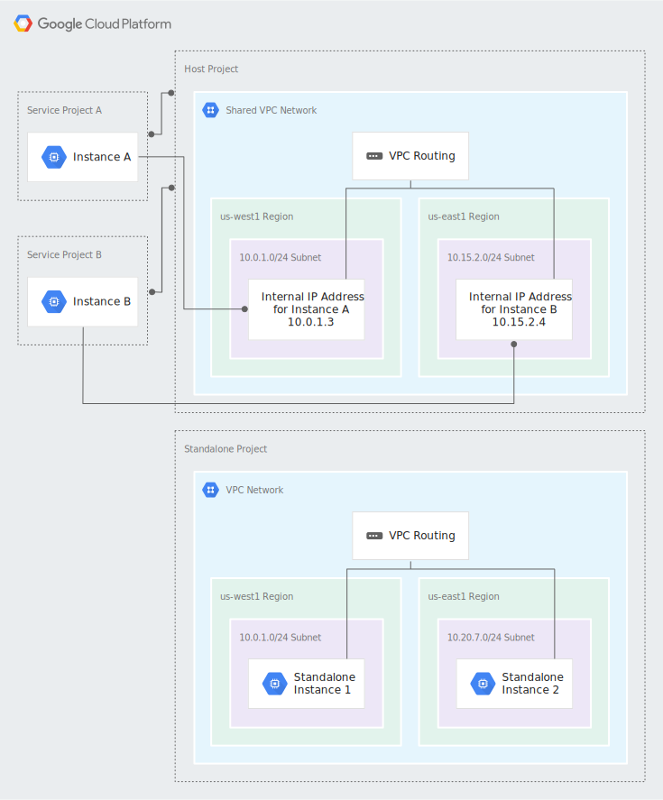

# Shared VPC

Overview:

- Shared VPC's are used to enable project based resource management in terms of security & billing
  The following diagram displays the usage of shared VPC's:

A Shared VPC Admin for the organization has created a host project and attached two service projects to it:

Service Project Admins in Service Project A can be configured to access all or some of the subnets in the Shared VPC network. A Service Project Admin with at least subnet-level permissions to the 10.0.1.0/24 Subnet has created Instance A in a zone of the us-west1 region. This instance receives its internal IP address, 10.0.1.3, from the 10.0.1.0/24 CIDR block.

Service Project Admins in Service Project B can be configured to access all or some of the subnets in the Shared VPC network. A Service Project Admin with at least subnet-level permissions to the 10.15.2.0/24 Subnet has created Instance B in a zone of the us-east1 region. This instance receives its internal IP address, 10.15.2.4, from the 10.15.2.0/24 CIDR block.

The Standalone Project does not participate in the Shared VPC at all; it is neither a host nor a service project. Standalone instances are created by IAM members who have at least the compute.InstanceAdmin role for the project.
